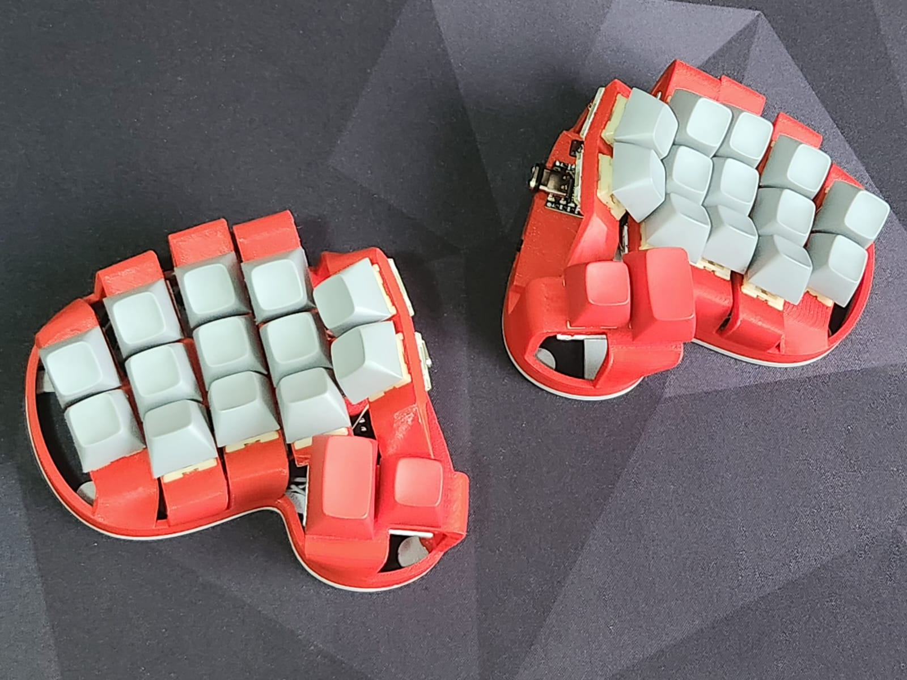
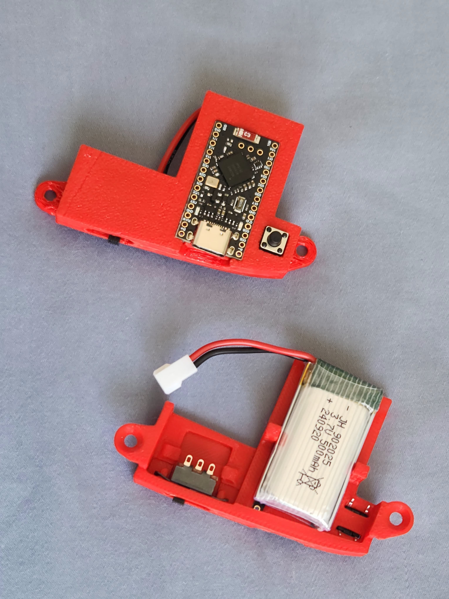

# rommana-remix
A remix of Rommana that supports a Nice Nano v2 / Supermini NRF 52840 and Single Switch PCBs.

This remix introduces the following changes, on top of the [original Rommana](https://github.com/AlaaSaadAbdo/Rommana):
- Make the switch holders thicker (5mm), so that the PCBs can sit flush.
- Add switch lockers to the switch holders.
- Increase the height of the base of the body in 5mm, to accomodate a 500mAh battery.
- Adjust screw holes.
- Add a detachable components socket that holds:
    - MCU: nice-nano v2 or Supermini NRF52840
    - On/off switch or an USC-C breakout board
    - Reset button

These changes were made preserving as much as possible the original design.

More build pictures can be found [here](img/build.md).

A ZMK firmware implementation can be found in my [keyboards](https://github.com/rafaelromao/keyboards) repo.
